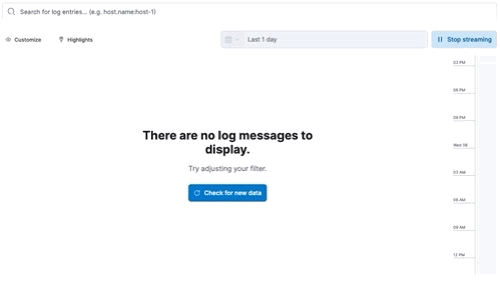

# Aplicacion para la persistencia de Logs (Python, Elasticsearch, Kibana)

# Instala Docker

- [Docker](https://www.docker.com/)

---

# Docker Network
Estríctamente hablando, no es necesario crear una network, pero para fines demostrativos 
realizaremos el proceso creando una: 
`docker network create elastic`

Revisa las conexiones que tiene esta network
`docker network inspect elastic`

---

## Obtenemos las imagenes de los contenedores que utilizaremos

### MySQL
`docker pull mysql:latest`
#### Si se va a acceder a la base de datos desde la máquina host para ingresar datos manualmente, las credenciales son:
```
host="0.0.0.0"
puerto="3008"
database="punto_de_venta"
user="root"
password="root"
```

### Elasticsearch
`docker pull docker.elastic.co/elasticsearch/elasticsearch:7.15.2`

### Kibana
`docker pull docker.elastic.co/kibana/kibana:7.15.2`

---

## Corremos los primeros contenedores
### MySQL
`docker run --name=Docker_Punto_de_Venta --net elastic -p 3308:3306 -e MYSQL_ROOT_PASSWORD=root -d mysql:latest`

### Elasticsearch
`docker run --name es01 --net elastic -p 127.0.0.1:9200:9200 -p 127.0.0.1:9300:9300 -e "discovery.type=single-node" docker.elastic.co/elasticsearch/elasticsearch:7.15.2`
#### Revisamos Elasticsearch
`localhost:9200`

### Kibana
`docker run --name kib01 --net elastic -p 127.0.0.1:5601:5601 -e "ELASTICSEARCH_HOSTS=http://es01:9200" docker.elastic.co/kibana/kibana:7.15.2`
#### Revisamos Kibana
`localhost:5601`

---

## Para el contenedor que almacena nuestro proyecto

**Verifique que las IP's a las que se esten apuntando sean las correctas**

- En el archivo *filebeat.yml*
```
setup.kibana:
  # Kibana Host
  # Scheme and port can be left out and will be set to the default (http and 5601)
  # In case you specify and additional path, the scheme is required: http://localhost:5601/path
  # IPv6 addresses should always be defined as: https://[2001:db8::1]:5601
  host: "172.18.0.4:5601"
``` 

```
output.elasticsearch:
  # Array of hosts to connect to.
  hosts: ["172.18.0.3:9200"]
``` 
- En el *database_properties_prod.txt*
``` 
host="172.18.0.2"
database="punto_de_venta"
user="root"
password="root"
``` 

### Construimos la imagen
`docker build -t devopspython .`

### Corremos la imagen
`docker run --name devopspython --net elastic devopspython`

---

## Aplicación en Ejecución

### Almacenar las tablas en Google Drive


### Almacenar los logs de la aplicación utilizando Elasticsearch y Kibana



---

## Algunos comandos extras que pueden ser utiles

Para docker
    : `docker network ls` : Para listar todas las redes que se encuentran disponibles

Para la CLI de los contenedores que se utilizan:
    : `nano [filename]` : Abrir un archivo
    : `service filebeat status` : Revisar el estatus del servicio
    : `cmd + d` : Cerrar la CLI del contenedor
